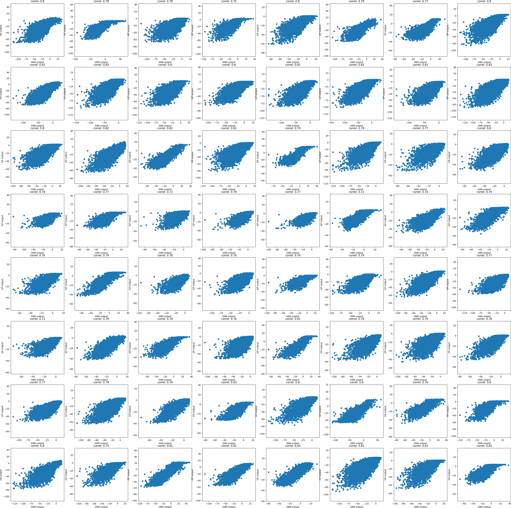

# Demo of Applying GPEX for MiniImagenet
We trained a resnet classifier on MiniImagenet for 50 epochs. The classifier reached an accuracy of 50.
Note that in the mini-imagenet dataset there are 36 labels which are only present in the test set (for zero-shot learning research).
We excluded those labels when training the classifier.

Becuase of the rebuttal time limit **GPEX was trained only for 2 epochs**, but according to the below figure even 
after 2 epochs of training GPEX, the GPs are highly correlated with ANN (coef around 80).

To run the demo, please do the following:
- In the current directory, create a folder named "NonGit/".
- Download and extract the MiniImgenet datset in the "NonGit" folder. [https://cseweb.ucsd.edu/~weijian/static/datasets/mini-ImageNet/]
- Download the following file and place it in "NonGit/": [https://drive.google.com/file/d/1LtbkReJ-5wAZB4sDrM7SorYloYXJWruN/view?usp=sharing]
